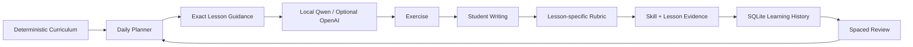

# Writing Trainer

> A local-first, adaptive English writing trainer for ESL learners — with a deterministic curriculum, AI-generated practice, rubric-based grading, spaced review, and persistent learning history.

Writing Trainer is designed around one core idea:

**The LLM should not decide what the learner studies.**

The curriculum, lesson sequence, mastery rules, review schedule, and grading rubric are deterministic. A local or cloud model is used only where language models are useful: generating varied exercises, interpreting natural-language answers, and producing concise feedback.

## Why this project is different

Many AI tutoring demos are essentially:

```text
Prompt → LLM → answer
```

Writing Trainer uses a controlled learning loop instead:



| Typical AI tutor | Writing Trainer |
| --- | --- |
| LLM improvises what to teach | 12-stage deterministic curriculum |
| One generic prompt for grading | Lesson-specific grading rubric |
| Little or no durable learning state | SQLite history, sessions, sets, mastery, review queue |
| Repeats prompts easily | Saved-prompt deduplication and regeneration checks |
| "Correct" is often binary | Independent / first-try / assisted evidence |
| Cloud API is usually required | Local-first with Ollama + Qwen |
| Refresh loses progress | Persistent practice sessions and resume |

## Current curriculum

The curriculum is authored in code and seeded into SQLite at startup. It is **not generated by the LLM**.

- **12 stages**
- **52 detailed lessons**
- Stage goals and advancement rules
- Prompt-language policy by stage
- Expected response length
- Generation guardrails
- Lesson objectives
- Grammar rules
- Common error patterns
- Prompt-pattern examples
- Required elements
- Explicit "avoid" rules
- Difficulty guidance

The path moves from controlled sentence writing toward independent school-style writing:

1. Sentence Foundations
2. Present-Time Control
3. Past-Time Control
4. Future and Modal Meaning
5. Joining Ideas
6. Time and Condition Clauses
7. Wh- and Noun Clauses
8. Relative Clauses
9. Sentence Expansion
10. Connected Writing
11. Paragraph Writing
12. School Writing

## Core features

### Today — adaptive daily practice

The planner selects what should be practiced. The model receives exact item-by-item lesson guidance and generates the wording of the exercises.

Each question displays its curriculum location:

```text
Stage 3 · Past-Time Control
Lesson · did / didn't + base verb
Skill · Did / didn't

Practice target:
Use did/didn't for past questions and negatives with the base form.
```

### Plan — inspectable curriculum

The Plan page exposes the actual teaching specification used to guide generation:

- objective
- grammar rules
- common mistakes
- prompt patterns
- required elements
- difficulty
- exclusions / things to avoid

This makes the AI behavior inspectable instead of hidden inside a vague prompt.

### Rubric-based grading

The grading model is instructed to evaluate in this order:

1. meaning coverage
2. assigned lesson target
3. grammar
4. tense
5. capitalization and punctuation

The reference answer is treated as **one valid answer, not an exact-match key**.

The server also applies deterministic checks and consistency rules. For example, an answer such as `ki` cannot be accepted as a complete sentence even if a model responds incorrectly.

### Mastery evidence

Not all correct answers are treated equally.

Examples of current evidence weighting:

- independent first-try correct: strongest evidence
- correct after revision: strong evidence
- correct after Hint 1: reduced evidence
- correct after deeper hints: lower evidence
- correct after opening the model answer: minimal mastery evidence

### Spaced review

Weak or failed skills enter a review queue. Successful review increases the interval; repeated mistakes return the skill to earlier review.

### Saved Practice Sets

Every generated set is archived.

You can:

- replay old sets without calling the LLM
- resume unfinished sessions
- rename sets
- favorite sets
- inspect the original questions

### Persistent sessions

Practice sessions preserve:

- current question
- draft answer
- number of attempts
- hint level
- model-answer usage
- final correctness
- first-try correctness
- independent correctness
- latest grading feedback

### Progress dashboard

The dashboard shows:

- current curriculum stage
- stage-blocking lessons
- lesson mastery
- skill mastery
- recent session scores
- first-try vs independent accuracy
- error patterns
- drill-down into actual mistakes

### History

History can be filtered by:

- time range
- practice mode
- skill
- error category
- result

Each check can be expanded to inspect the original prompt, answer, feedback, suggestion, corrected sentence, and evidence strength.

## Local-first AI

The default setup is designed for Ollama and a local Qwen model.

Current default model:

```text
hf.co/unsloth/Qwen3.5-9B-GGUF:UD-Q4_K_XL
```

The server can also use OpenAI as an optional provider or fallback.

Ollama endpoints are auto-detected from:

```text
configured OLLAMA_BASE_URL
http://127.0.0.1:12000
http://127.0.0.1:11434
```

Exercise generation is batched so a local 9B model does not need to generate 12–20 exercises in a single response.

## Quick start — Windows

### 1. Clone

```powershell
git clone https://github.com/oneminute/writing-trainer.git
cd writing-trainer
```

### 2. Install Node.js

Use Node.js 20 or newer.

### 3. Install dependencies

```powershell
npm install
```

### 4. Create local configuration

```powershell
Copy-Item .env.example .env
```

The default local-AI configuration is suitable for Ollama.

### 5. Start Ollama

Example using port 12000:

```powershell
$env:OLLAMA_HOST="127.0.0.1:12000"
ollama serve
```

Make sure the configured model is available in Ollama.

### 6. Start Writing Trainer

For one computer:

```powershell
.\start-writing-trainer.bat
```

For another computer on the same home LAN:

```powershell
.\start-writing-trainer-lan.bat
```

The LAN launcher listens on port 5178. Open:

```text
http://<host-computer-ip>:5178
```

from the learner's computer.

## Configuration

See `.env.example`.

Important settings include:

```env
LLM_PROVIDER=ollama
OLLAMA_BASE_URL=http://127.0.0.1:12000
OLLAMA_WRITING_MODEL=hf.co/unsloth/Qwen3.5-9B-GGUF:UD-Q4_K_XL
OLLAMA_WRITING_TIMEOUT_SECONDS=60
OLLAMA_GENERATION_TIMEOUT_SECONDS=180
OLLAMA_GENERATION_BATCH_SIZE=4
```

Optional OpenAI fallback:

```env
OPENAI_API_KEY=
OPENAI_MODEL=gpt-5.6-luna
```

Do not commit your `.env` file.

## Data and privacy

Learning data is stored locally in:

```text
data/writing-trainer.db
```

The `data/` directory and `.env` are ignored by Git.

With `LLM_PROVIDER=ollama`, writing checks and exercise generation are performed through the local Ollama server. Cloud-provider behavior depends on your configured provider.

## Project structure

```text
writing-trainer/
├─ public/
│  ├─ index.html
│  ├─ app.js
│  └─ styles.css
├─ scripts/
│  └─ smoke-test.mjs
├─ src/
│  ├─ curriculum.js
│  ├─ exercises.js
│  └─ plan.js
├─ data/                  # local SQLite data, gitignored
├─ server.js
├─ .env.example
├─ start-writing-trainer.bat
└─ start-writing-trainer-lan.bat
```

## Testing

```powershell
npm test
```

The test suite currently includes:

- JavaScript syntax checks
- isolated temporary SQLite database
- Settings API
- detailed curriculum API
- Today flow
- Progress API
- History API
- saved sets
- session creation and persistence
- resume behavior
- deterministic short-answer rejection
- starter-prompt regression checks

The Windows launchers run `npm test` before starting the application.

## Design principles

1. **Curriculum is deterministic.**
2. **The LLM does not control progression.**
3. **Every AI-generated exercise must map to an explicit lesson.**
4. **Grading follows a lesson-specific rubric.**
5. **A correct answer is not automatically strong mastery evidence.**
6. **Learning history must survive refreshes and restarts.**
7. **Old practice should remain reusable.**
8. **Local models should be first-class, not an afterthought.**
9. **The student should gradually move from translation support to independent writing.**
10. **The system should be inspectable by a parent, teacher, or developer.**

## Documentation

- [Architecture](docs/ARCHITECTURE.md)
- [Demo / screenshot capture guide](docs/DEMO_CAPTURE.md)
- [Promotion copy](docs/PROMOTION.md)
- [Recommended GitHub metadata](docs/GITHUB_METADATA.md)
- [Public launch checklist](docs/PUBLIC_LAUNCH_CHECKLIST.md)
- [Draft release notes](docs/RELEASE_NOTES_DRAFT.md)
- [Roadmap](ROADMAP.md)
- [Contributing](CONTRIBUTING.md)
- [Security](SECURITY.md)
- [Changelog](CHANGELOG.md)

## Status

Writing Trainer is currently a pre-1.0 project under active development.

The current implementation is especially focused on a sixth-grade ESL learner, but the architecture is intended to generalize to other learner profiles and curricula.

## Contributing

Bug reports, curriculum improvements, grading edge cases, local-model compatibility work, and UX improvements are welcome.

See [CONTRIBUTING.md](CONTRIBUTING.md).

## License

Writing Trainer is licensed under the **Apache License 2.0**.

Apache-2.0 is a permissive open-source license that allows use, modification, redistribution, and commercial use subject to its terms, and it includes an explicit patent license.

See [LICENSE](LICENSE).
