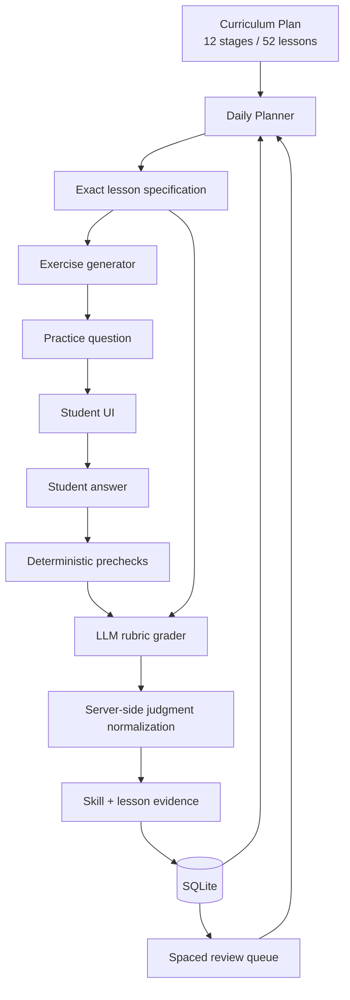

# Architecture

Writing Trainer separates **deterministic learning control** from **probabilistic language generation**.

That boundary is the central design decision in the project.

## System model



## Why not let the LLM plan the curriculum?

A general-purpose model can produce plausible educational content, but it is not a stable curriculum engine.

If the model chooses both **what to teach** and **how to grade it**, several problems appear:

- progression changes between runs
- important prerequisites can be skipped
- practice can become repetitive or stylistically biased
- grading criteria drift
- "correct" can become model-dependent
- debugging a bad exercise is difficult because the intended objective is unclear

Writing Trainer therefore treats the LLM as a constrained component.

The model receives an already-selected lesson with:

- objective
- grammar rules
- common errors
- required elements
- prompt-pattern examples
- difficulty
- explicit exclusions
- stage-level language and output rules

The model is asked to realize that specification as a natural exercise.

## Curriculum layer

Authoritative curriculum data lives in:

```text
src/plan.js
```

At startup it is seeded/upserted into SQLite:

```text
curriculum_stages
curriculum_lessons
lesson_attempts
```

The database is therefore the runtime source used by the application, while the code file is the version-controlled authoring source.

### Stage progression

Progression is lesson-based rather than only skill-based.

A lesson currently needs repeated evidence and sufficient mastery before it stops blocking advancement.

Broad skill mastery remains useful for trend analysis, but stage advancement uses the more precise lesson representation.

## Planner layer

The planner decides which skills should appear in a practice session.

The current daily mix includes:

- due review
- weak skills
- current-stage material
- mixed reinforcement

For each selected skill, the system selects a concrete curriculum lesson.

The model does not select the lesson.

## Generation layer

Exercise generation is batched for local models.

A generated item must pass server validation for:

- required count
- allowed skill
- exact lesson ID
- stage-appropriate prompt language
- required 3-level hint structure
- non-empty model answer
- no duplicate prompts within the set
- no exact normalized prompt reuse from saved practice history

Generation failures are retried under controlled conditions.

## Grading layer

Grading receives the same curriculum context used to generate the exercise.

The rubric evaluates:

1. meaning coverage
2. assigned lesson target
3. grammar
4. tense
5. capitalization
6. punctuation

The model answer is a semantic and structural reference, not an exact-match key.

### Deterministic prechecks

Some failures should never require an LLM decision.

For example, a fragment such as:

```text
ki
```

cannot be a complete answer to a normal sentence-writing exercise.

The server rejects clearly incomplete submissions before invoking the model.

### Server-side normalization

The server also prevents contradictory model judgments.

For example, a response equivalent to:

```text
grammar = needs_work
skillSuccess = false
correct = true
```

is normalized so that overall correctness cannot be true.

This makes the model advisory within a controlled scoring contract rather than the final authority.

## Evidence model

Correctness and mastery are different concepts.

A student can eventually produce a correct answer after receiving help, but that should not count as the same evidence as an independent first-try response.

The application records:

- attempt count
- hint depth
- model-answer usage
- first-try correctness
- independent correctness
- lesson success
- evidence score

This supports more meaningful mastery estimates.

## Persistence model

SQLite stores the learning state.

Major concepts include:

- curriculum stages
- curriculum lessons
- attempts
- lesson attempts
- skill attempts
- review queue
- generated sets
- practice groups
- practice sessions
- practice session items
- application settings

Generated practice is archived rather than treated as disposable output.

## Local-first model routing

The default provider is Ollama.

The server probes:

1. configured `OLLAMA_BASE_URL`
2. `127.0.0.1:12000`
3. `127.0.0.1:11434`

The first working endpoint becomes the active local provider.

OpenAI can be configured as an optional provider or fallback.

## Trust boundaries

Writing Trainer intentionally does **not** trust the LLM with:

- curriculum progression
- stage advancement
- persistence
- review scheduling
- exercise ownership / saved-set identity
- short-answer completeness checks
- final consistency of grading fields

The LLM is trusted for:

- natural exercise wording
- semantic equivalence
- grammar interpretation
- natural corrections
- concise child-friendly feedback

## Design direction

The long-term architecture should continue moving toward:

```text
deterministic control plane
+
probabilistic language layer
```

rather than increasing the model's authority over the learning system.
